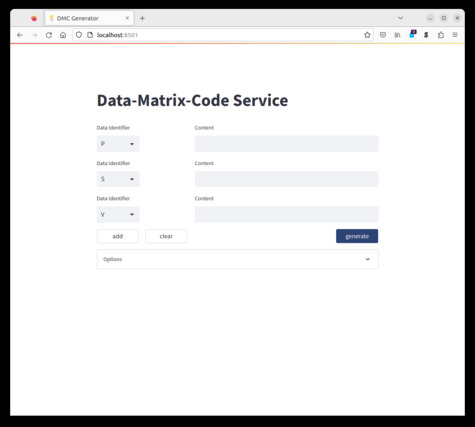
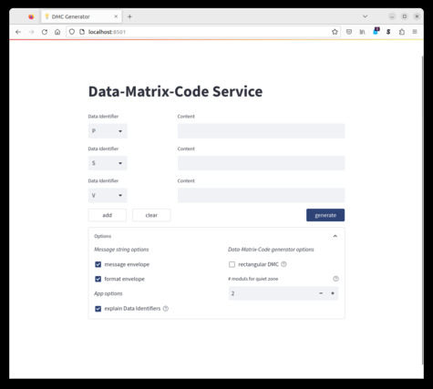
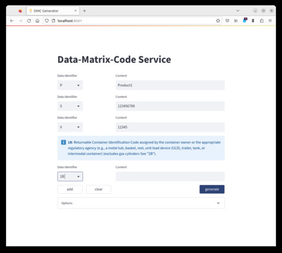
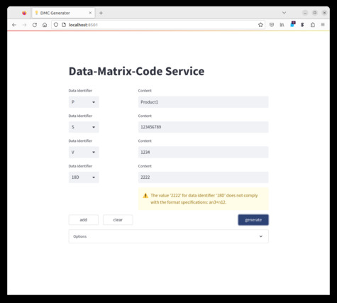
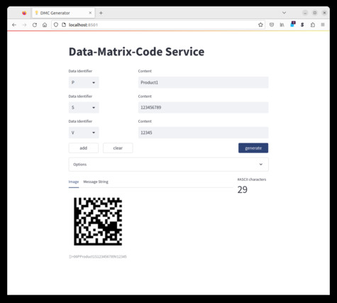
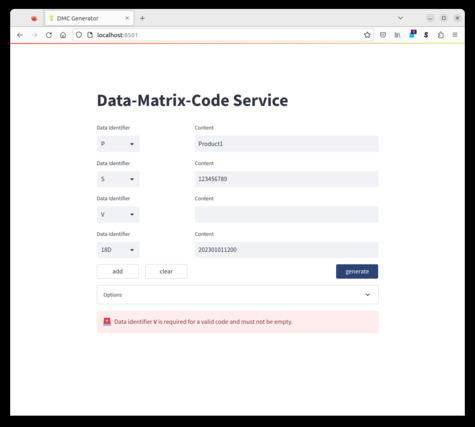

# Data-Matrix-Code-Generator-Service
Python-based functions to build, parse message strings according to the ANSI MH-10 standard and generate a Data-Matrix-Code from it wrapped in a mirco-service for a convenient web-frontend.

## Description
Python-based micro-service to generate Data-Matrix-Codes that use ANSI-MH 10 field identifiers (sometimes also referred to as "data identifiers") and message and format envelopes according to ISO / IEC 15434. 

The web-service is build on [streamlit](https://streamlit.io/), which is a python-package for building an interactive website and includes also a web server engine.

## Installation and Usage
The project is meant to be compiled to a Docker container. See Dockerfile for installation instructions.

### Usage
The initial page shows only the required fields, if any are specified. If not, the initial page consists of a single row (data identifier as drop down menu + input field).



Note that you can change the options dynamically when expanding the container "options". The options are stored for the session. The default options can be specified for in the configuration file when starting the streamlit server (for examples see below.)



When selecting a new data identifier, the corresponding explanation is displayed above the row:



and a warning is issued when the input does not comply with the expected format.



For generating a code simply click the button "generate". A correct message string is created automatically and the number of ASCII characters of this string is displayed next to the image of the code. 



Note that no DMC is generated if one leaves one of the required fields empty.




### Configuration
[streamlit](https://streamlit.io/) can be configured via a TOML file [config.toml](config.toml), e.g. the `primarycolor` of the overall theme (see config file as example or the streamlit-docs).
We extended this file to add a section `[DMC]`, where one can specify field identifiers that should be required in the code. This is an array of strings. One can connect two identifiers as OR with an | symbol. See example.

```TOML
[DMC]
requiredDataIdentifiers = ["P", "S|T", "V"]
```
You can specify the default option values with the following keys (this are the default values, which do not have to be explicitly specified.)
```TOML
[DMC]
UseMessageEnvelope = true
UseFormatEnvelope = true
RectangularDMC = false
NumberOfQuietZoneModuls = 2
ExplainDataIdentifiers = true
````


### Installation
#### manual
Install Python 3.9 (or later) and its package management PIP. Create a virtual environment; then install the requirements to it
```shell
pip install -r requirements.txt
```
Now run [streamlit](https://streamlit.io/)
```shell
streamlit run App-Data-Matrix-Generator.py
```

#### Docker
Build docker container based on Python3.9
```shell
docker build --tag=dmc-generator/streamlit .
```
Run container
```shell
docker run -d -p 8502:8501 --name=streamlit-dmc-generator dmc-generator/streamlit
```


## Authors and acknowledgment
max-scw


## License
This project is licensed under the [AGLPv3](https://www.gnu.org/licenses/agpl-3.0.en.html) - see the [LICENSE](LICENSE) file for details.
The python library [treepeom](https://github.com/adamchainz/treepoem), which is used to generate DMCs, uses [ghostscript](https://ghostscript.com/releases/gsdnld.html). The open-source [license of ghostscript](https://ghostscript.com/licensing/index.html) uses a [AGLPv3](https://www.gnu.org/licenses/agpl-3.0.en.html) license (strong copy-left license, i.e. all code in a project that uses ghostscript must be made available as open-source with the same license) but also offers a commercial license. Therefore the project is also bined to AGLPv3 license. 
If there is a way to replace ghostscript, I would be happy to publish the code under a more liberal scheme.

## Status
maintenance only

